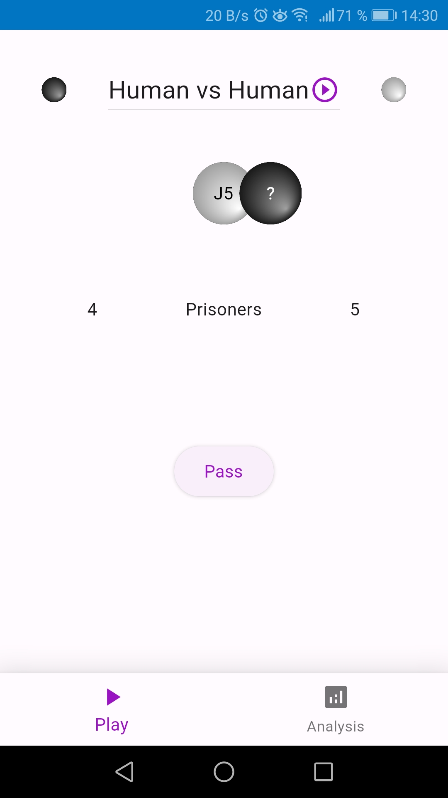
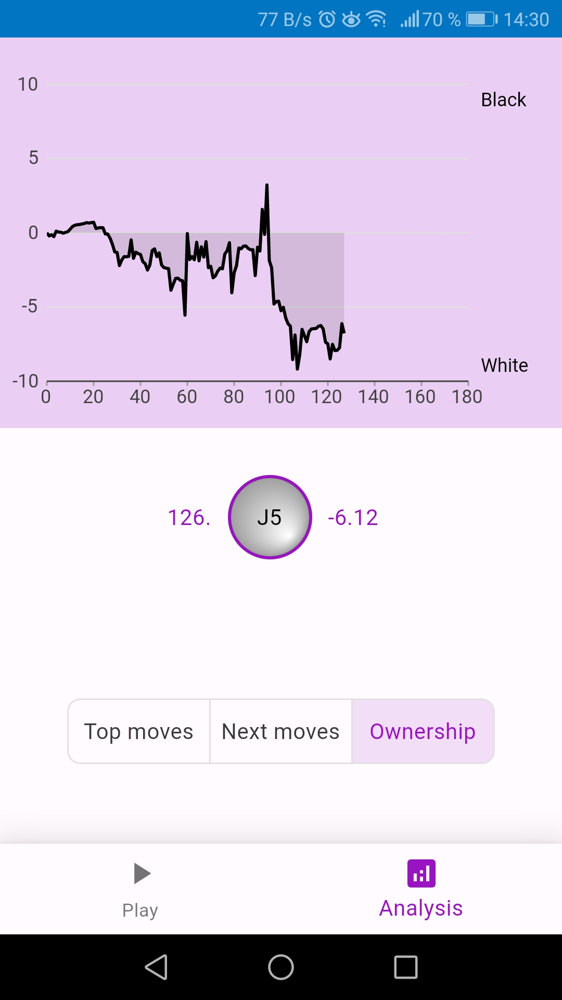

# Saiboard
Saiboard is an open-source Go board that combines tradition with technology.

Experience the thrill of Go on a real board, enhanced by AI guidance and analysis tools.

Play against AI, review your games with AI assistance, and elevate your Go skills to new heights.

https://github.com/miliar/saiboard/assets/35922697/eb32aec5-f142-464d-a071-56e9dbfe0f72

Features:

- Wooden Go [board](https://github.com/miliar/saiboard/tree/main/board) for authentic gameplay
- Sensory [electronics](https://github.com/miliar/saiboard/tree/main/electronics) for accurate move detection and LED feedback
- Heavy, magnetic Go [stones](https://github.com/miliar/saiboard/tree/main/stones) for a stable and engaging experience
- [Software](https://github.com/miliar/saiboard/tree/main/software ) with integrated AI system KataGo for expert insights and game recommendations
- User-friendly [web app](https://github.com/miliar/saiboard/tree/main/software/flutter/saiboard) for effortless control and interaction

## App
  

## Board
### Next moves

### Top moves

### Ownership

