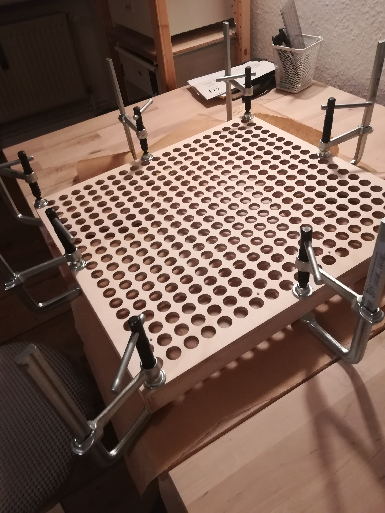

# Board
The board has a top made of plywood with holes for the LED lights. \
A layer of veener is put over the holes to make a smooth surface. \
Resin is poured into the holes to protect the lights and make the board more sturdy.

## How to build
- Cut [pieces](/board/cnc_files/) out of plywood.
  - Thickness Sides: 10 mm Bottom: 5 mm Top: 6,5 mm
- [Glue](https://www.amazon.de/Titebond-Classic-Holzleim-118-506/dp/B0044UKJ62/ref=sr_1_25?crid=1SK2T75CZSW6B&keywords=wood+glue+titebond&qid=1646995490&sprefix=woodglue+tit%2Caps%2C122&sr=8-25) and clamp over night

- Sanding
- Cut pieces out of 0,6 mm thick veener, a bit larger area than top piece of board
- Put glue to the top of the board and to the veener, let it dry, then iron on veener.
- Cut or sand veener to size
- (Oil finish)
- Fill inside with enough resin to cover holes
- 4 layers of [poly](https://www.amazon.de/Minwax-polycryl-40910-wipe-%C3%96l-basierende-1-pint/dp/B01MU1VFWV/ref=sr_1_2?__mk_de_DE=%C3%85M%C3%85%C5%BD%C3%95%C3%91&crid=3KM669XAYLPRG&keywords=wipe+on+poly&qid=1702393895&sprefix=wipe+on+poly%2Caps%2C101&sr=8-2)
- Apply the grid. This [pen](https://www.amazon.de/rOtring-isograph-Tuschef%C3%BCller-0-8/dp/B000USK8KY?pd_rd_w=x2T64&content-id=amzn1.sym.5a3fbeeb-1af1-4617-a0f9-8268dbe71de3&pf_rd_p=5a3fbeeb-1af1-4617-a0f9-8268dbe71de3&pf_rd_r=WWQM3NB11PE3SJR8HZ25&pd_rd_wg=nTHxF&pd_rd_r=0e77853c-7d85-448c-9176-808936add03e&pd_rd_i=B000USK8KY&ref_=pd_basp_d_rpt_ba_s_1_t&th=1) works great. You can assemble the two 3d print files with a spring for a penholder similiar to [this instruction](https://www.instructables.com/Spring-loaded-CNC-Penholder-for-Rapidograph-techni/) and [use the cnc to apply the lines](https://www.reddit.com/r/baduk/comments/13xi005/tachi_mori_2023/?utm_source=share&utm_medium=web3x&utm_name=web3xcss&utm_term=1&utm_content=share_button). Apply star points by hand.
- Finish with some layers of poly and sanding

