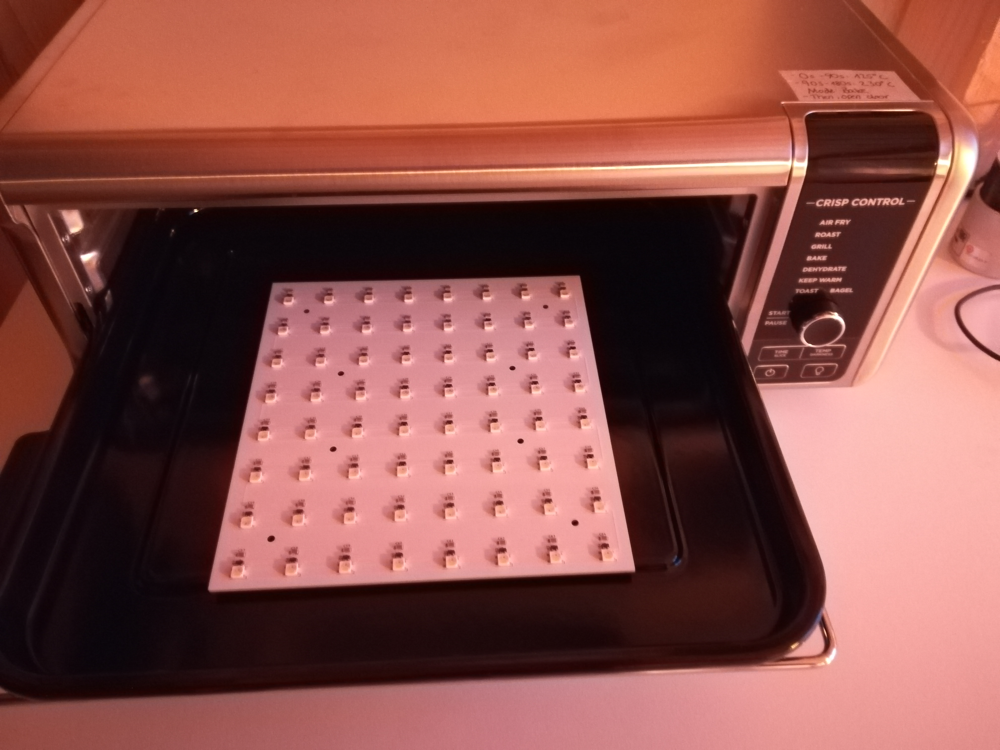
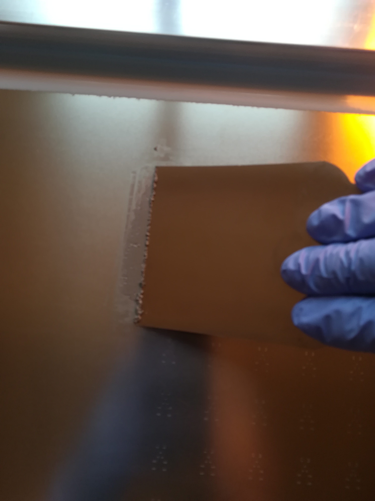

# Electronics
The electronics consists of one touch plate, an array of 19x19 hall sensors (for detecting magnets) and LEDs. \
The touch plate is used to detect when a move is finished, so that sliding the stone in position is possible. \
It is controlled by an ESP32S3 microcontroller.\
To make the manufacturing process easier, the board is divided into several smaller PCBs. \
There is a power connection for a raspberry pi.

## How to build
### PCBs

- [Order](https://jlcpcb.com/) PCB/ Stencil
- [Solderpaste](https://www.mouser.de/ProductDetail/Chip-Quik/TS391AX50?qs=1mbolxNpo8c66lK8U%252Bbg8g%3D%3D)
- Solder led side first
- [Reflow oven](https://www.ninjakitchen.de/produkte/ninja-foodi-8-in-1-multifunktionsofen-sp101eu-zidSP101EU?gclid=CjwKCAiAg6yRBhBNEiwAeVyL0K_J3ElNVxI_Z_oyhJKBGCfaiXaV0-DiEXvF-BnwtabYrZho8xsRyhoCo1UQAvD_BwE): Bake 3 min, 0-90s: 125° C, 90-180s: 230° C, then open door

- Print [plastic parts](/electronics/3d_prints/)
- Place pcb mask on first side, apply paste to the second side. Then remove pcb mask and bake pcb while placed on e.g. nuts

  

### Touch plate
Put copper foil on printed pcb-masks, remove foil from holes. Eletrical and physical connect all pcb masks. Glue non copper side to pcb first side with double sided tape. Solder connection to copper side and connect to touch pin of microcontroller.

### Mounting
- Press [esp32s3](https://docs.espressif.com/projects/esp-idf/en/latest/esp32s3/hw-reference/esp32s3/user-guide-devkitc-1.html#getting-started) in socket
- Use [screws](https://www.amazon.de/gp/product/B00XPJG1OC/ref=ppx_yo_dt_b_asin_title_o05_s00?ie=UTF8&psc=1) out of **stainless steel**.
- Enlarge mount holes of raspberry pi 4 to 3mm and fix it with the plastic mount. Connect power pins to board.
- Connect board power out to [adapter](https://www.amazon.de/Delock-Terminalblock-2pin-5mm-65421/dp/B009PH1J5Y/ref=pe_27091401_487027711_rtpb_2/259-0379054-1449235/ref=rtpb?_encoding=UTF8&pd_rd_i=B009PH1J5Y&pd_rd_w=x8W3O&content-id=amzn1.sym.474647f1-64c1-44ba-87f5-6213cf212586&pf_rd_p=474647f1-64c1-44ba-87f5-6213cf212586&pf_rd_r=0J4VFHEDP0EWMRD7EHXF&pd_rd_wg=oGq6l&pd_rd_r=6c2ec190-8354-4455-b1a1-8aa1fa129738&th=1). Glue adapter into hole on the side of the board.
- Use a 5V/ 10A, 50W [power supply](https://www.amazon.de/LEICKE-Netzteil-Adapter-WS2812B-LED8806/dp/B07YVBHH6K?pd_rd_w=0m35S&content-id=amzn1.sym.5a3fbeeb-1af1-4617-a0f9-8268dbe71de3&pf_rd_p=5a3fbeeb-1af1-4617-a0f9-8268dbe71de3&pf_rd_r=37PZ5YX5WHR4K52V4X9C&pd_rd_wg=4ZrhK&pd_rd_r=1ae78b2e-2f51-4e24-866a-adc47f1cd7c7&pd_rd_i=B07YVBHH6K&psc=1&ref_=pd_basp_d_rpt_ba_s_3_t)
