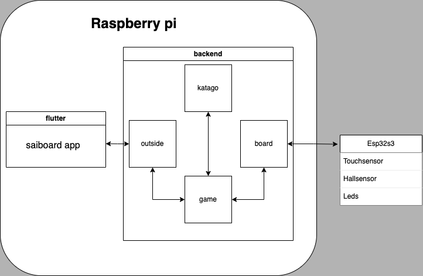

# Software
The microcontroller chip on the board creates a local Wi-Fi network, to which you will need to connect your device. Once connected, you can access the Saiboard web interface by going to the local address 192.168.4.5:8000 .

The backend and frontend of Saiboard are hosted on the local Raspberry Pi. This setup keeps everything bundled into the board.

If you want to use a more powerful machine for a stronger and faster AI, you can install the backend on a different device.

## Architecture

The core of Saiboard's architecture is built around three main components:

- [esp32s3](https://github.com/miliar/saiboard/tree/main/software/esp32s3): This microcontroller chip handles the board's physical controls, communicates with the backend server, and creates the local Wi-Fi network.

- [backend](https://github.com/miliar/saiboard/tree/main/software/backend): This server software runs on the Raspberry Pi and provides the AI functionality, game logic, and interface capabilities.

- [saiboard](https://github.com/miliar/saiboard/tree/main/software/flutter/saiboard): This is the user interface (UI) part of Saiboard, which runs in your web browser and displays the game information and AI insights and also allows you to control the board directly.



## Set up rasberry pi 4
- Install raspos 64 bit lite with ssh https://www.tomshardware.com/reviews/raspberry-pi-headless-setup-how-to,6028.html
- Install docker https://docs.docker.com/engine/install/debian/
- Add network in /etc/wpa_supplicant/wpa_supplicant.conf
- Prepend domain-name-servers 8.8.8.8, 8.8.4.4; >> /etc/dhcp/dhclient.conf , then sudo dhclient
- Set static ip for rasberry pi to 192.168.4.5(flutter needs static real ip for websocket) https://www.tomshardware.com/how-to/static-ip-raspberry-pi
- Add start up to /etc/rc.local:
```
    # docker backend
    sudo docker compose -f /home/rashid/backend/docker-compose.yml  up -d
    # flutter
    (cd /home/rashid/flutter  && sudo python -m http.server 8000) &
```

## Deploy to rasberry pi 4
### Deploy flutter
- `cd software/flutter/saiboard`
- `flutter clean`
- `flutter build web --web-renderer canvaskit --release`  https://docs.flutter.dev/deployment/web
- change wifi to saiboard
- `scp -r build/web/* rashid@saiboardrasp.local:/home/rashid/flutter` https://www.simplified.guide/ssh/copy-file
- delete browser cache for app

### Deploy backend
- `scp -r ../../backend/* rashid@saiboardrasp.local:/home/rashid/backend`
- `ssh saiboardrasp.local`
- `rm backend/katago/Dockerfile & mv backend/katago/Dockerfile_rasp backend/katago/Dockerfile`
- change network on rasberry pi to internet (`sudo nano /etc/wpa_supplicant/wpa_supplicant.conf`)
- reboot, connect via wifi internet,`ssh saiboardrasp.local` 
- `cd backend`
- `docker compose down`
- `docker compose build`
- In case of build errors like "Could not connect to ports.ubuntu.com:80", try:
    - `sudo dhclient`
    - `docker image prune -a`
- `docker compose up`
- change network back to saibord, reboot rasberry pi

## Deploy to esp32s3
- [linux/macos](https://docs.espressif.com/projects/esp-idf/en/latest/esp32s3/get-started/linux-macos-setup.html#start-a-project)
- [via vscode extension](https://github.com/espressif/vscode-esp-idf-extension/blob/HEAD/docs/tutorial/basic_use.md)
