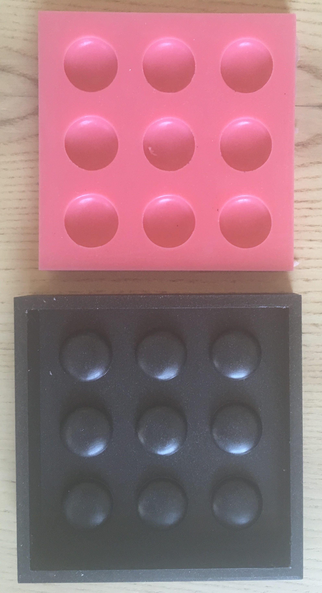
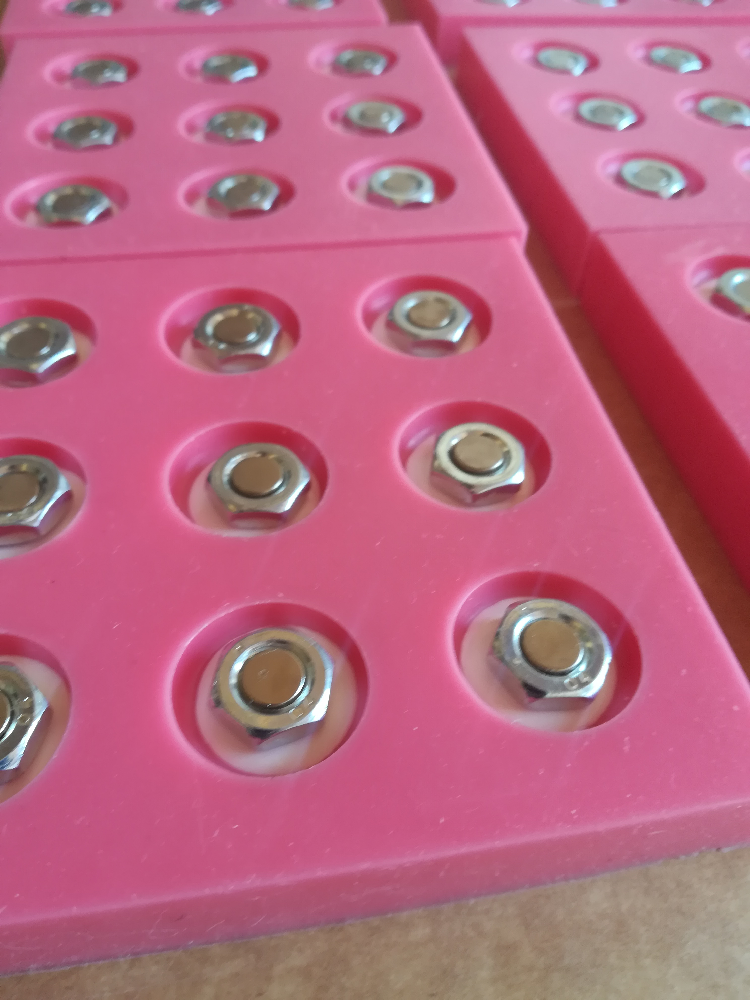

# Stones
The stones are made from resin. \
They are filled with a small magnet that is enclosed in a hexagonal nut. This design serves two purposes: it helps to shield the magnetic field from interfering with others, and it adds weight to the stone for a better gaming experience. \
Each stone weighs approximately 3 grams. 

## How to make the silicone mold

- 3d print the positive mold
- Sand it
- Use [Primer/Filler](https://www.amazon.de/edding-Permanent-Spray-Kunststoffgrundierung-Kunststoff-Oberfl%C3%A4chen/dp/B00CSLMC0U/ref=sr_1_4?__mk_de_DE=%C3%85M%C3%85%C5%BD%C3%95%C3%91&crid=3IHZ0S0T4P5OT&keywords=edding%2Bprimer&qid=1646993696&s=officeproduct&sprefix=edding%2Bprimer%2Coffice-products%2C193&sr=1-4&th=1) for smooth surface
- Fill with 130 g [silicone](https://www.amazon.de/Wagnersil-Premium-Silikon-Kautschuk-Dubliersilikon/dp/B01703HDWW?pd_rd_w=7DFyl&pf_rd_p=cc86faef-1f96-4af1-b512-2733302d2b97&pf_rd_r=7JDDC5J7N622CM7N5JP1&pd_rd_r=7e79af39-5fdb-415a-9516-e1403fc6833d&pd_rd_wg=emuYZ&pd_rd_i=B01703HDWW&psc=1&ref_=pd_bap_d_rp_1_t)

## How to make stones
- Mix [resin](https://www.amazon.de/Epoxidharz-Qualit%C3%A4t-geruchsarm-Laminier-Schutzhandschuhe/dp/B07D3SB9M9?pd_rd_w=Al8c9&pf_rd_p=cc86faef-1f96-4af1-b512-2733302d2b97&pf_rd_r=TJ1G6K5S96M96NMX0ZSZ&pd_rd_r=0837ef43-08e8-41e2-9c21-49ac5c3e71a0&pd_rd_wg=2JB9u&pd_rd_i=B07D3SB9M9&psc=1&ref_=pd_bap_d_rp_1_i) with 5% [color](https://www.amazon.de/100g-Farbpaste-schwarz-RAL-9005/dp/B00BIZDTEA?pd_rd_w=Al8c9&pf_rd_p=cc86faef-1f96-4af1-b512-2733302d2b97&pf_rd_r=TJ1G6K5S96M96NMX0ZSZ&pd_rd_r=0837ef43-08e8-41e2-9c21-49ac5c3e71a0&pd_rd_wg=2JB9u&pd_rd_i=B00BIZDTEA&psc=1&ref_=pd_bap_d_rp_6_i)
- Fill silicone mold with 0,3 ml
- Let it cure
- Push or hammer in 7x4 mm N35 neodym magnets in hexagon nut **zinc plated**( important because of magnetic properties) steel DIN 439 BM 8x1
- Place magnets into mold, **opposite** magnet direction for **each color**
  
- Fill up with 1,3 ml resin
- Remove bubbles with torch
- After curing, remove sharp edges by wet sanding of flat bottom and edge. For this, 3d print the stone holder and add one of the magnets to the hole.
- Rinse black stones with isopropanol and polish with a bit oil
